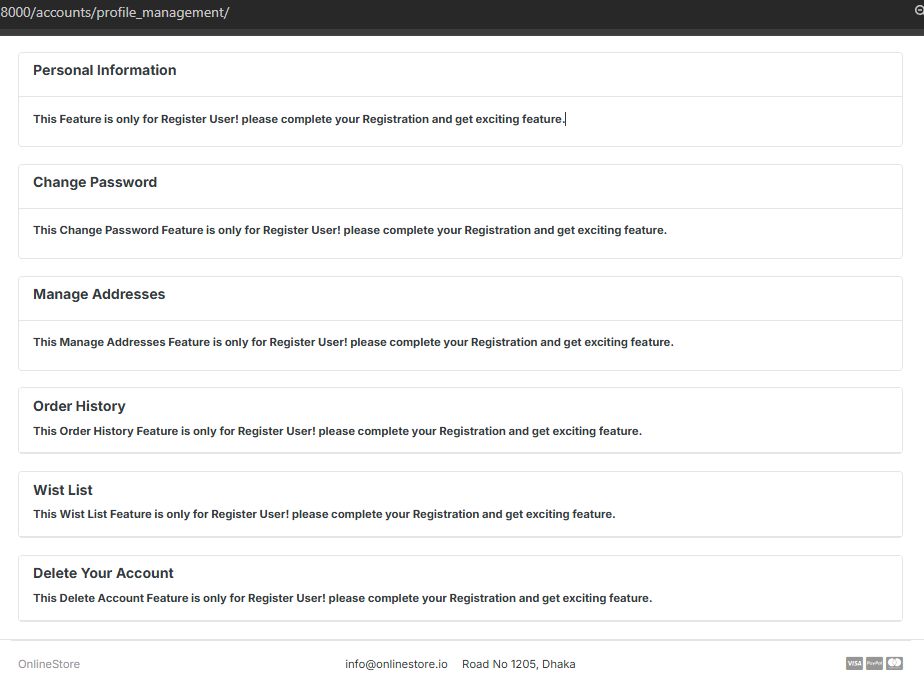

# DJANGO MART

This is an e-commerce website built using Django that allows users to browse products, add items to a shopping cart, place orders, and manage their account. The website also provides an admin interface for managing products, orders, and users.

## Features
- User Authentication: Users can sign up, log in, and manage their accounts.
    - sign_up: Users can sign up using email verification.
       

       

       
    
       
       
    - login: Users can login using register email and password
       

       

    - forget password: If Users forget the password he/she change the password 
       

- Users profile management: Users can change their profile picture, change their address , update their personal information etc.
    - Profile for unregister User:
       
       
    
    -Profile for register User:
        
        
        
        
        

- Users Dashboard feature: Dashboard feature is only for register user.
  In Users dashboard severall functionality have exists such as:
    - Dashboard front page:
        

    - All product category:
        

    - make a prerequested order:
        

    - recent Order feature:
         

    - Seals statistics and report:
         

    - Top selling product:
         
         
    - all transactions features:
        
    
- Shopping Cart: Users can add products to their shopping cart, update quantities, and remove items.
    - add to cart feature:
        
    - increase and decrease feature:
        
        
    - remove cart feature:
        

- Order Management: Users can view their order history and track their current orders.
    - Order history:
      

    - recent order:
      
    
    - place order:
      

- Product Catalog: Users can browse products by categories, view product details, and search for products.
    - home page or store:
      
    - store for un-register user:
      

    - store for register user:
      

    - product detail for un-register user:
      
    
    - product detail for register user:
      

    - out of stock feature:
      

- Search and filtering feature: Users can view their product using Search and filtering feature:
    - search by keyword:
      

    - search by category:
       
       

- pagination feature: Users can view their product using pagination feature:
    
    - overall pagination:
      
      

    - category based pagination:
      
      

- Wish list feature: Users can add their product to wish list and purchase this product easily using this feature:
      - add to wish list:
         

- comment and review feature: Users can make their comment and give review using comment and review feature feature:
    - 
    - 

- Payment Integration: Integration with a payment gateway (e.g., sslcommerz) for handling online fake - - - payments.
    - pre step for make a paymet:
      

    - make a fake payment:
      
    
    - confirm a fake payment:
       
    
    - transaction report after a payment:
       

- Responsive Design: Optimized for desktops, tablets.

## Upcoming Features

- *Weather Alerts:* Receive weather alerts for severe conditions.
- *Widget Support:* Add weather information directly to your home screen.
- *Localization:* Support for multiple languages.
- *Dark Mode:* Supports system-wide dark theme.
- *Current Weather:* Displays real-time weather data, including temperature, humidity, wind speed, and more.
- *Hourly Forecast:* Provides weather forecast for the upcoming hours.
- *Multiple Locations:* Track weather for different locations by entering a city.
- *User-friendly Interface:* Simple and intuitive UI for a seamless user experience.
- *Offline support:* Store weather data for up to 24 hours for offline access for searched city.

## Limitations

- some simple dug has present.
- some spelling mistake has present.
- comparatively lower UI desing.
